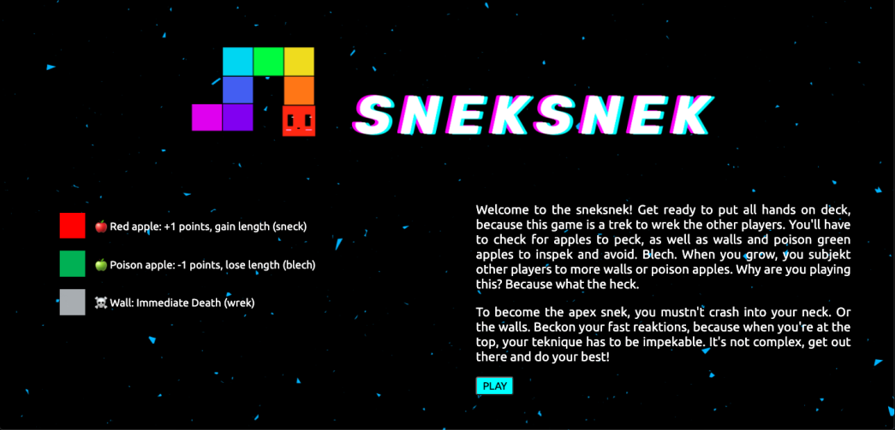

# sneksnek
Inspiration
Quarantine is boring. sneksnek is fun as heck. We wanted to create the classic snake game with a mix of battle royale. Based on the concepts behind games like tetris 99, sneksnek allows you to battle against other people online to claim the title of apex snek.

## What it does
Welcome to sneksnek! Get ready to put all hands on deck, because this game is a trek to wrek the other players. You'll have to check for apples to peck, as well as walls and poison green apples to inspek and avoid. Blech. When you grow, you subjekt other players to more walls or poison apples.

🍎 Red apple: +1 points, gain length (sneck)

🍏 Poison apple: -1 points, lose length (blech)

☠️ Wall: Immediate Death (wrek)

To become the apex snek, you mustn't crash into your neck. Or the walls. Beckon your fast reaktions, because when you're at the top, your teknique has to be impekable. It's not complex, get out there and do your best!

## How we built it
We developed the game with HTML5, CSS3, and JavaScript. We used repl.it to collaborate online. For the gameplay graphics and functionality, we used the library p5.js. To create rooms to allow for the individual games to connect with each other, we used Socket.io.

## Challenges we ran into
One challenge we ran into was scaling the snake to the size of the screen. Initially, our design had the snake with a constant size regardless of screen size, with the canvas changing its width and height to match. We quickly realized this gave an unfair advantage to people with larger screen sizes, and were forced to rewrite much of the scaling to allow for the snake to scale up and down with the grid, so as to eliminate biases favoring larger screens.

Another challenge we ran into was that, initially, when we started up the socket, the p5.js script refused to run. After lots of debugging, we discovered p5.js's instance mode. This mode allows the p5 script to act as an object, allowing us to initialize multiple rooms with the same p5 object, giving them access to unique instances of the game board within a shared socket.io room.

## Accomplishments that we're proud of
We are extremely proud of the design of sneksnek. From the background to the design of our little snek, we are really happy with how our final product turned out. We are also happy with the scalability of our project, as, while currently only 3 players are allowed in the room at once, this can be scaled up in the scenario where the game becomes more popular. We are also very proud of our creative domain name from domain.com: sneksnek.tech

## What we learned
We learned that we should not start a 24 hour hackathon when we only have less than 10 hours left. This was stressful. Sneksnek does not approve.

## What's next for sneksnek
Sneksnek has a bright future in the dark space, in the future we have plans to implement sneksnek in 3D and perhaps even movement for the x, y, and z position with a whole platform/maze.